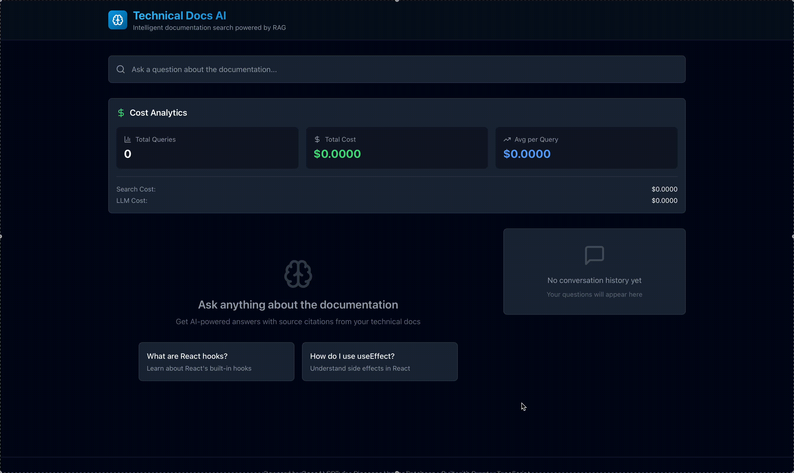

# Technical Docs AI - Full-Stack RAG Application

> Production-ready Retrieval-Augmented Generation system with React frontend for semantic documentation search

[](https://opensource.org/licenses/MIT)
[](https://www.typescriptlang.org/)
[](https://nodejs.org/)
[](https://reactjs.org/)

## 🎯 Overview

A complete **full-stack RAG (Retrieval-Augmented Generation)** application combining:
- 🎨 **Modern React Frontend** - Beautiful UI with real-time search, conversation history, and cost tracking
- ⚡ **Express API Backend** - RESTful API with hybrid search and Q&A endpoints
- 🔍 **Hybrid Search Engine** - Vector (semantic) + keyword (BM25) search with fusion
- 🤖 **LLM Integration** - GPT-4o-mini with streaming support for real-time responses
- 📚 **Smart Citations** - Automatic source document highlighting and references

### ✨ Latest Updates

#### 🏗️ Milestone 4 - Layered Architecture (October 2025) ✅
**NEW:** Backend refactored with clean architecture principles following 2025 best practices!

**Architecture Improvements**:
- 📐 **Layered Architecture** - Presentation, Application, Domain, Infrastructure layers
- 🔧 **Dependency Injection** - Centralized DI container for all dependencies
- 📦 **Repository Pattern** - Abstract data access (easy to swap memory → PostgreSQL)
- 🎯 **Service Layer** - Business logic separated from HTTP concerns
- 🏭 **Factory Pattern** - Clean creation of complex domain objects
- ✅ **Testable** - Mock interfaces, test layers in isolation
- 🔄 **Flexible** - Swap implementations without changing business logic

See [ARCHITECTURE_SUMMARY.md](./ARCHITECTURE_SUMMARY.md) for details.

#### ✅ Milestone 3 - Frontend Complete
**Full-stack application with React frontend is now live!**

**Frontend Features**:
- 🎨 **Beautiful Dark UI** - Modern design with Tailwind CSS
- 🔍 **Real-time Search** - Instant Q&A with streaming responses
- 📝 **Conversation History** - Track all your queries and answers
- 📊 **Cost Analytics** - Live tracking of API costs per query
- 📚 **Source Highlighting** - View and explore source documents
- 📱 **Responsive Design** - Works on desktop, tablet, and mobile

**Backend Features**:
- 🚀 **Express API Server** - RESTful endpoints for search and Q&A
- 🔄 **Streaming Support** - Server-Sent Events for real-time responses
- 💾 **Repository Pattern** - Pluggable storage (memory/database)
- 🔍 **Hybrid Search** - Combines vector + keyword search
- 📊 **Re-ranking** - MMR for optimal result ordering

## 🎬 Demo



*Full-stack RAG application in action: Real-time search, AI-generated answers with citations, conversation history, and cost tracking*

## 🚀 Quick Start

### Prerequisites

- Node.js >= 18.0.0
- npm >= 9.0.0
- OpenAI API key ([Get one here](https://platform.openai.com/api-keys))
- Pinecone API key ([Get one here](https://www.pinecone.io/))

### Installation

```bash
# Clone repository
git clone https://github.com/yourusername/technical-docs-ai.git
cd technical-docs-ai

# Install all dependencies (monorepo)
npm install

# Configure backend environment
cd packages/rag-engine
cp .env.example .env
# Edit .env with your API keys

# Return to root
cd ../..
```

### Environment Configuration

Edit `packages/rag-engine/.env`:

```bash
# OpenAI
OPENAI_API_KEY=sk-...
EMBEDDING_MODEL=text-embedding-3-small
LLM_MODEL=gpt-4o-mini

# Pinecone
PINECONE_API_KEY=...
PINECONE_INDEX=technical-docs
PINECONE_REGION=us-east-1

# Server
PORT=3001
```

### Running the Application

```bash
# Option 1: Run both frontend and backend together
npm run dev

# Option 2: Run separately
npm run dev:backend    # Backend on http://localhost:3001
npm run dev:frontend   # Frontend on http://localhost:3000
```

### First Time Setup

```bash
# 1. Set up vector database (one-time)
cd packages/rag-engine
npm run setup:vectordb

# 2. Add your documentation (see Document Ingestion section below)
# The demo uses React documentation markdown files
# Place your .md, .pdf, or .html files in data/raw/

# 3. Ingest documentation
npm run ingest:docs

# 4. Start the application
cd ../..
npm run dev
```

Then open your browser to **http://localhost:3000**

## 📄 Document Ingestion

The RAG system supports ingesting documentation from multiple formats. The `data/raw` directory is **not tracked in the repository** - you need to add your own documentation files.

### Supported Formats

| Format | Extension | Loader | Notes |
|--------|-----------|--------|-------|
| **Markdown** | `.md` | MarkdownLoader | Preserves headings and code blocks |
| **PDF** | `.pdf` | PDFLoader | Extracts text from PDF documents |
| **HTML** | `.html` | HTMLLoader | Parses HTML and extracts text content |

### Setting Up Your Documentation

#### Option 1: Demo with React Documentation (Recommended for Testing)

The demo shown in the GIF uses official React documentation markdown files:

```bash
cd packages/rag-engine

# Create data directory
mkdir -p data/raw

# Clone React documentation (or download specific files)
# Example: Download from https://github.com/reactjs/react.dev
git clone --depth 1 https://github.com/reactjs/react.dev.git temp-react-docs

# Copy markdown files to data/raw
cp -r temp-react-docs/src/content/learn/*.md data/raw/
cp -r temp-react-docs/src/content/reference/react/*.md data/raw/

# Clean up
rm -rf temp-react-docs

# Ingest the documentation
npm run ingest:docs
```

#### Option 2: Use Your Own Documentation

```bash
cd packages/rag-engine/data/raw

# Add your markdown files
cp /path/to/your/docs/*.md .

# Add your PDF files
cp /path/to/your/docs/*.pdf .

# Add your HTML files
cp /path/to/your/docs/*.html .

# Ingest the documentation
cd ../..
npm run ingest:docs
```

### Directory Structure

```
packages/rag-engine/
├── data/
│   ├── raw/                    # ← Place your source files here (not tracked by git)
│   │   ├── *.md               # Markdown files
│   │   ├── *.pdf              # PDF files
│   │   └── *.html             # HTML files
│   └── processed/             # Processed chunks (generated, not tracked)
```

### Ingestion Process

The ingestion pipeline performs the following steps:

1. **Loading**: Reads files from `data/raw/` using appropriate loaders
2. **Chunking**: Splits documents into semantic chunks (~500 tokens)
3. **Embedding**: Generates vector embeddings using OpenAI's `text-embedding-3-small`
4. **Indexing**: Stores vectors in Pinecone for semantic search

```bash
# View ingestion logs
npm run ingest:docs

# Example output:
# 📁 Loading documents from data/raw...
# ✅ Loaded 50 documents
# 📊 Chunking documents...
# ✅ Created 243 chunks
# 🔢 Generating embeddings...
# ✅ Generated 243 embeddings
# 📤 Uploading to Pinecone...
# ✅ Indexed 243 vectors
```

### Ingestion Configuration

Edit `packages/rag-engine/.env` to customize chunking:

```bash
CHUNK_SIZE=500        # Tokens per chunk (default: 500)
CHUNK_OVERLAP=50      # Overlap between chunks (default: 50)
```

### Best Practices

1. **Document Format**: Markdown is preferred for code documentation
2. **File Size**: Keep individual files under 10MB for optimal processing
3. **Structure**: Use clear headings (H1, H2, H3) in markdown for better chunking
4. **Naming**: Use descriptive filenames (e.g., `react-hooks.md` vs `doc1.md`)
5. **Organization**: Group related documents in subdirectories

### Example: Adding Documentation

```bash
# 1. Navigate to data directory
cd packages/rag-engine/data/raw

# 2. Add your documentation
cat > getting-started.md << 'EOF'
# Getting Started

This is a sample documentation file.

## Installation

Install the package using npm:

```bash
npm install my-package
```

## Usage

Import and use the package:

```javascript
import { myFunction } from 'my-package';
myFunction();
```
EOF

# 3. Ingest the new documentation
cd ../..
npm run ingest:docs

# 4. Start the application
npm run dev
```

### Troubleshooting

#### "No documents found in data/raw"
- Ensure files are in `packages/rag-engine/data/raw/`
- Check file extensions (`.md`, `.pdf`, `.html`)
- Verify files are not empty

#### "Embedding API error"
- Check your OpenAI API key in `.env`
- Ensure you have API credits available
- Verify your API key has access to `text-embedding-3-small`

#### "Pinecone connection error"
- Verify Pinecone API key in `.env`
- Ensure index exists (run `npm run setup:vectordb`)
- Check index name matches `PINECONE_INDEX` in `.env`

### Re-ingesting Documents

If you add new documents or update existing ones:

```bash
cd packages/rag-engine

# Option 1: Delete index and re-ingest all documents
npm run delete:index
npm run setup:vectordb
npm run ingest:docs

# Option 2: Just ingest (will add to existing index)
npm run ingest:docs
```

### Cost Estimation

Ingestion costs (one-time):
- **Embeddings**: ~$0.02 per 1000 documents (small chunks)
- **Storage**: Free tier supports 100K vectors in Pinecone

Example: Ingesting React documentation (~50 files, ~250 chunks):
- Embedding cost: ~$0.005
- Storage: Free (well within limits)

## 🏗️ Architecture

This project follows a **Layered Architecture Pattern** based on clean architecture principles:

```
┌─────────────────────────────────────────────┐
│         Presentation Layer                  │  ← HTTP Controllers & Routes
├─────────────────────────────────────────────┤
│         Application Layer                   │  ← Services & Use Cases
├─────────────────────────────────────────────┤
│         Domain Layer                        │  ← RAG Engine & Core Logic
├─────────────────────────────────────────────┤
│         Infrastructure Layer                │  ← Repositories & External APIs
└─────────────────────────────────────────────┘
```

**Key Benefits**:
- ✅ Separation of concerns
- ✅ Easy to test and maintain
- ✅ Flexible to swap implementations
- ✅ Ready for microservices

📖 See [ARCHITECTURE_SUMMARY.md](./ARCHITECTURE_SUMMARY.md) for detailed documentation.

## 📁 Project Structure

```
technical-docs-ai/                    # Monorepo root
├── packages/
│   ├── rag-engine/                   # Backend - RAG Engine & API
│   │   ├── src/
│   │   │   ├── presentation/        # Layer 1: Controllers & Routes
│   │   │   ├── application/         # Layer 2: Services & Interfaces
│   │   │   ├── infrastructure/      # Layer 4: Repositories & DI
│   │   │   ├── rag/                 # Layer 3: RAG Q&A engine
│   │   │   ├── search/              # Layer 3: Hybrid search system
│   │   │   ├── reranking/           # Layer 3: Re-ranking strategies
│   │   │   ├── prompts/             # Layer 3: Prompt templates
│   │   │   ├── llm/                 # Layer 3: LLM integration
│   │   │   ├── ingestion/           # Document loaders & chunkers
│   │   │   ├── vectordb/            # Pinecone client
│   │   │   ├── scripts/             # CLI tools
│   │   │   └── server.ts            # Express API server
│   │   ├── data/raw/                # Source documentation
│   │   ├── ARCHITECTURE.md          # Detailed architecture docs
│   │   └── package.json
│   │
│   └── frontend/                     # Frontend - React App
│       ├── src/
│       │   ├── App.tsx              # Main application
│       │   ├── components/          # React components
│       │   │   ├── SearchInput.tsx
│       │   │   ├── AnswerDisplay.tsx
│       │   │   ├── SourceCard.tsx
│       │   │   ├── ConversationHistory.tsx
│       │   │   └── CostTracker.tsx
│       │   ├── hooks/               # Custom React hooks
│       │   ├── api/                 # API client
│       │   └── types/               # TypeScript types
│       └── package.json
│
├── package.json                      # Root package (workspaces)
├── ARCHITECTURE_SUMMARY.md           # Architecture overview
└── README.md
```

## 🎨 Frontend Features

### Real-time Search
- **Instant Q&A** - Ask questions and get AI-generated answers with sources
- **Streaming Responses** - See answers appear in real-time (optional)
- **Smart Suggestions** - Example questions to get you started

### Conversation History
- **Track All Queries** - Never lose your previous questions
- **Quick Navigation** - Click any previous query to view its results
- **Clear History** - Remove all conversations with one click

### Source Documents
- **Highlighted Sources** - See exactly which documents were used
- **Relevance Scores** - Know how well each source matches your query
- **Context Display** - View source location, heading, and line numbers
- **Syntax Highlighting** - Code snippets displayed beautifully

### Cost Analytics
- **Real-time Tracking** - Monitor API costs as you use the app
- **Query Statistics** - Total queries, average cost per query
- **Cost Breakdown** - Separate search and LLM costs
- **Auto-refresh** - Updates every 5 seconds

## 🔌 API Endpoints

### Backend Server (Port 3001)

| Endpoint | Method | Description |
|----------|--------|-------------|
| `/health` | GET | Health check |
| `/api/search` | POST | Hybrid search (no AI answer) |
| `/api/qa` | POST | Full Q&A with RAG pipeline |
| `/api/history` | GET | Get conversation history |
| `/api/history` | DELETE | Clear conversation history |
| `/api/analytics/cost` | GET | Get cost analytics |

### Example API Usage

```bash
# Search for documents
curl -X POST http://localhost:3001/api/search \
  -H "Content-Type: application/json" \
  -d '{"query": "What are React hooks?", "topK": 10}'

# Ask a question
curl -X POST http://localhost:3001/api/qa \
  -H "Content-Type: application/json" \
  -d '{"query": "How do I use useEffect?", "stream": false}'

# Get cost analytics
curl http://localhost:3001/api/analytics/cost
```

## 🛠️ Tech Stack

### Frontend
| Component | Technology |
|-----------|-----------|
| **Framework** | React 18.3 |
| **Language** | TypeScript 5.9 |
| **Build Tool** | Vite 7.1 |
| **Styling** | Tailwind CSS 3.4 |
| **Icons** | Lucide React |
| **Markdown** | react-markdown |

### Backend
| Component | Technology |
|-----------|-----------|
| **Runtime** | Node.js 18+ |
| **Framework** | Express 4.18 |
| **Language** | TypeScript 5.3 |
| **LLM** | OpenAI GPT-4o-mini |
| **Embeddings** | text-embedding-3-small |
| **Vector DB** | Pinecone |
| **Keyword Search** | natural (BM25) |

## 📈 Performance

### Frontend
- **First Load** - < 2 seconds
- **Search Response** - 8-12 seconds (full RAG pipeline)
- **UI Updates** - Instant (React 18)
- **Bundle Size** - ~500 KB (optimized)

### Backend
- **Search Time** - 1.3-2.4 seconds
- **Re-ranking** - 2-5 ms
- **LLM Generation** - 5-10 seconds
- **Total End-to-End** - 7-12 seconds

### Costs
- **Per Query** - $0.01-0.03
- **Ingestion** - ~$0.02 (one-time)
- **Vector Storage** - Free tier (100K vectors)

## 📚 Available Scripts

### Root (Monorepo)
```bash
npm run dev                # Run both frontend & backend
npm run dev:frontend       # Run only frontend
npm run dev:backend        # Run only backend
npm run build              # Build both packages
npm run typecheck          # Type check all packages
npm run lint               # Lint all packages
```

### Backend (packages/rag-engine)
```bash
npm run dev                # Start API server (dev mode)
npm run build              # Build TypeScript
npm run start              # Start production server
npm run setup:vectordb     # Initialize Pinecone
npm run ingest:docs        # Ingest documentation
npm run demo:rag           # CLI demo (no server)
```

### Frontend (packages/frontend)
```bash
npm run dev                # Start dev server
npm run build              # Build for production
npm run preview            # Preview production build
npm run typecheck          # Type check
npm run lint               # Lint code
```

## 🎯 Usage Examples

### Basic Search
1. Open http://localhost:3000
2. Type a question like "What are React hooks?"
3. View the AI answer and source documents
4. Check cost analytics in the sidebar

### Conversation History
1. Ask multiple questions
2. View all queries in the right sidebar
3. Click any previous query to view it again
4. Clear history when done

### Cost Tracking
1. Monitor costs in real-time
2. View total queries and average cost
3. See breakdown of search vs LLM costs
4. Analytics update automatically

## 🔧 Configuration

### Backend Configuration
Edit `packages/rag-engine/.env`:
- `CHUNK_SIZE` - Tokens per chunk (default: 500)
- `CHUNK_OVERLAP` - Overlap between chunks (default: 50)
- `PORT` - API server port (default: 3001)

### Frontend Configuration
Edit `packages/frontend/vite.config.ts`:
- API proxy configuration
- Port settings
- Build optimizations

## 🚧 Development Roadmap

### ✅ Milestone 1 - Core Infrastructure (Completed)
- [x] Document ingestion pipeline
- [x] Markdown/PDF/HTML support
- [x] Intelligent chunking
- [x] Vector embeddings
- [x] Pinecone integration

### ✅ Milestone 2 - RAG Pipeline (Completed)
- [x] Hybrid search (vector + keyword)
- [x] Re-ranking layer (MMR, Diversity, Relevance)
- [x] Prompt templates with context injection
- [x] LLM integration with streaming
- [x] Complete Q&A engine with citations

### ✅ Milestone 3 - Full-Stack Application (Completed)
- [x] Express API server
- [x] React frontend with Tailwind CSS
- [x] Real-time search interface
- [x] Conversation history
- [x] Cost tracking dashboard
- [x] Source document highlighting

### 🔜 Milestone 4 - Production Enhancements (Coming Soon)
- [ ] Streaming responses in UI
- [ ] User authentication & sessions
- [ ] Redis caching layer
- [ ] Database persistence (PostgreSQL)
- [ ] Advanced analytics dashboard
- [ ] Error logging & monitoring

### 🔮 Milestone 5 - Advanced Features (Future)
- [ ] Multi-user support with permissions
- [ ] File upload for custom documentation
- [ ] Fine-tuned embeddings
- [ ] Multi-modal support (images, diagrams)
- [ ] Agentic workflows
- [ ] Custom model integration

## 🤝 Contributing

Contributions welcome! Please see [CONTRIBUTING.md](CONTRIBUTING.md) for guidelines.

## 📄 License

MIT License - see [LICENSE](LICENSE) file for details.

## 🙏 Acknowledgments

- React documentation from [react.dev](https://react.dev)
- OpenAI for embeddings and LLM
- Pinecone for vector database
- Vite for blazing fast development

## 📞 Support

- 📧 Email: nemmar.ramos@gmail.com
- 🐛 Issues: [GitHub Issues](https://github.com/yourusername/technical-docs-ai/issues)
- 📖 Docs: [Project Wiki](https://github.com/yourusername/technical-docs-ai/wiki)

---

**Built with ❤️ by Nemmar Ramos**
